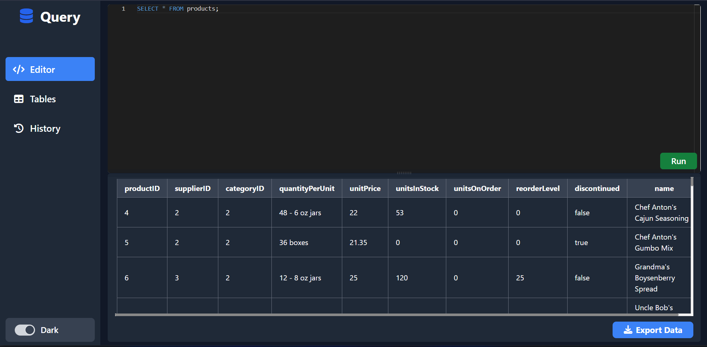
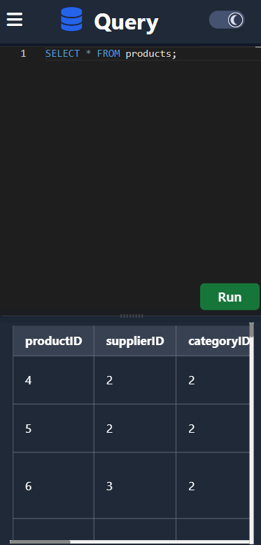
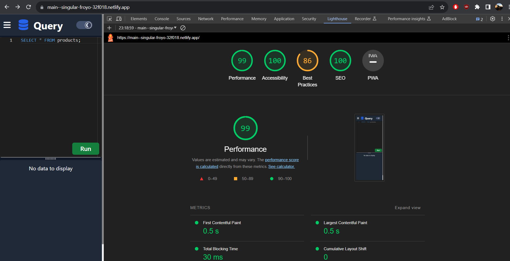

<h1 align="center">
    SQL Editor - Atlan Frontend Assignment
</h1>

Crafted by Sai Suvanth

<h2 align="center">Built using: </h2>

    
    
    

## View Demo on the Deployed Site 🚀

Click to https://sql-atlan-query.netlify.app/  view the deployed site 

## 👨‍💻 Features

- [x] Users can get data of any SQL queries by using SQL Editor.\
- [x] Users can download the output window table as CSV, with just a single click.
- [x] Users can visit thier previous queries by in the history page.
- [x] Users can refer to table metadata in the Tables metadata page.

## ✍️ Predefined SQL Queries

- `select * from customers`
- `select * from categories`
- `select * from employees`
- `select * from shippers`
- `select * from suppliers`

## ⚙️ NPM Modules Used

- `"@monaco-editor/react"` - Code editor that VsCode uses
- `"react-csv-downloader"` - To download the output as a simple CSV file
- `"react-toastify"` - To show the toast notifications for a success or error event
- `"react-reflex"` - To make adjustable panes in the UI
- `""next-themes"` - To maintain the dark and light theme of the app

## ⏱ Page Load Time

The Webapp loads in about 0.4 s to 0.6s, calculated using Lighthouse tool in Chromium based browsers. 

## 🪜 Steps I took to optimize the page load time

- Used CDN instead npm module for icons to minmize loading time.
- Used SVG icons wherever possible as they are lighter than image type icons.
- Used Lighthouse DevTools Extension to find the performance issues and fix them using their actionable suggestion.

## Available Scripts

In the project directory, you can run:

### `yarn start`

Runs the app in the development mode.\
Open [http://localhost:3000](http://localhost:3000) to view it in the browser.

The page will reload if you make edits.\
You will also see any lint errors in the console.

### `yarn build`

Builds the app for production to the `build` folder.\
It correctly bundles React in production mode and optimizes the build for the best performance.

The build is minified and the filenames include the hashes.\
Your app is ready to be deployed!

See the section about [deployment](https://facebook.github.io/create-react-app/docs/deployment) for more information.
